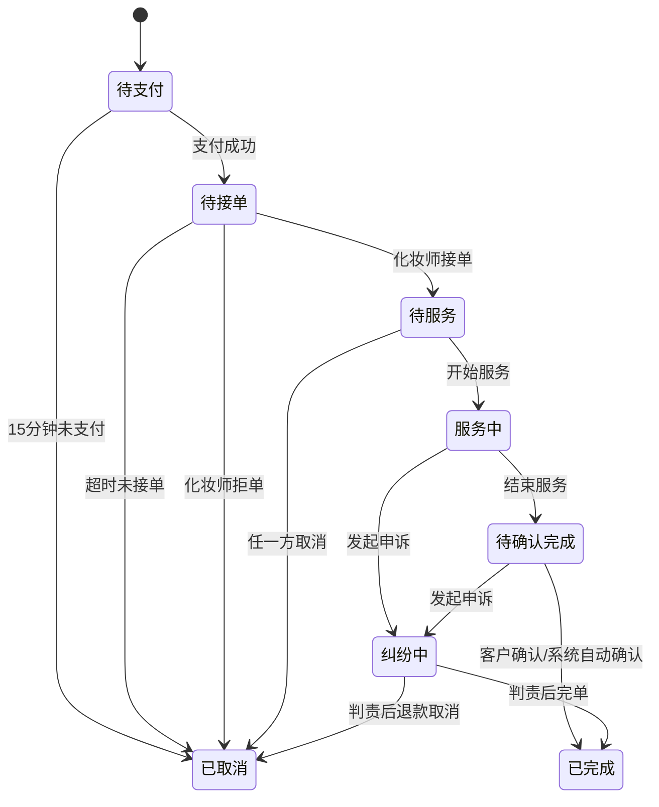

# PRD_上门美妆平台_BeautyGo v0.2

- 版本：`v0.2`
- 日期：`2026-03-23`
- 基于：`v0.1-Draft` 补强
- 文档定位：研发落地版 PRD
- 适用范围：`MVP（0-3个月）` + `成长期（4-9个月）`

## 1. 文档摘要

### 1.1 本次补强目标

本版文档在保留 v0.1 市场、定位、商业模式、技术路径等核心判断的基础上，重点补强以下内容：

1. 将产品描述从“方向型 PRD”升级为“可执行 PRD”。
2. 明确 MVP 的范围、非目标和阶段边界，避免过度开发。
3. 补齐交易规则、履约规则、异常处理和后台操作口径。
4. 给出页面信息架构、角色权限、对象定义、验收标准和埋点口径。
5. 让产品、设计、研发、测试、运营可以并行拆解任务。

### 1.2 关键结论

1. BeautyGo 的核心定位不变：专注上门美妆的 O2O 双边撮合平台。
2. MVP 采用“多场景通用预约”策略，支持旅拍/写真、聚会/晚宴、面试/商务、婚礼宾客妆。
3. MVP 不做派单/抢单、内容社区、会员体系、营销系统，但保留后续演进字段和数据结构。
4. MVP 默认化妆师自备化妆品，允许订单备注“客户自备”或“部分自备”。
5. 首发采用“单城市试点 + 微信小程序优先 + 人工运营兜底”。

## 2. 产品总纲

### 2.1 产品背景

当前美妆服务市场高度碎片化，用户获取服务和化妆师获取订单主要依赖以下路径：

1. 到店平台：如美团/大众点评，优势是交易成熟，但上门场景弱。
2. 私域接单：如小红书/抖音私信，优势是内容种草强，但缺乏信任和履约保障。
3. 婚庆/影视档期化妆师：聚焦高客单低频场景，无法覆盖日常化碎片需求。

市场痛点集中在四类：

1. 用户找不到合适且可信赖的上门化妆师。
2. 化妆师接单渠道分散，订单不稳定。
3. 交易、沟通、履约、评价分散在多个工具中完成。
4. 缺少针对上门美妆场景的标准化规则和平台保障机制。

### 2.2 产品愿景

让每个人在任何地方都能轻松获得专业美妆服务，让每一位化妆师都能把技术转化为稳定收入。

### 2.3 产品定位

BeautyGo 是一个专注上门美妆的 O2O 平台，面向有碎片化化妆需求的客户与有接单意愿的化妆师，提供“搜索、预约、支付、履约、评价、结算”一体化服务。

### 2.4 阶段目标

| 阶段 | 时间 | 核心目标 |
| --- | --- | --- |
| MVP | 0-3个月 | 验证交易闭环、完成首城冷启动、跑通服务规则 |
| 成长期 | 4-9个月 | 优化匹配效率、建立供给分层、实现单城市可复制增长 |
| 扩张期 | 10-18个月 | 多城市复制、内容生态与增值业务扩展 |

### 2.5 核心价值主张

| 角色 | 核心价值 |
| --- | --- |
| 客户 | 随时随地约到靠谱化妆师，价格透明、流程有保障 |
| 化妆师 | 把技术变成稳定收入，接单、履约、收款更高效 |

## 3. MVP 范围与非目标

### 3.1 MVP 业务目标

MVP 需要验证以下假设：

1. 客户愿意在平台完成上门化妆服务的在线预约和支付。
2. 化妆师愿意在平台完成认证、接单、履约和收款。
3. 平台可以通过规则设计将订单完成率维持在可控区间。
4. 单城市试点具备基础供需平衡和复购可能性。

### 3.2 MVP 支持场景

| 场景 | 说明 | 是否支持 |
| --- | --- | --- |
| 旅拍/写真妆 | 个人写真、景点出片、汉服旅拍 | 支持 |
| 聚会/晚宴妆 | 生日、聚餐、酒会、年会 | 支持 |
| 面试/商务妆 | 面试、见客户、正式场合 | 支持 |
| 婚礼宾客妆 | 非新娘本人，时长较短的宾客上妆 | 支持 |
| 新娘全天跟妆 | 含早妆、补妆、全天跟拍协作 | 不支持 |
| 跨城履约 | 异地城市接单、跨城交通协调 | 不支持 |
| 纯培训课程 | 线下/线上教学型服务 | 不支持 |
| 品牌合作链路 | 指定品牌返佣、联名套餐 | 不支持 |

### 3.3 MVP 功能模式

1. 客户通过搜索和筛选选择化妆师。
2. 客户直接发起预约并支付。
3. 化妆师在规定时间内接单或拒单。
4. 服务完成后平台触发评价与结算。

MVP 暂不包含：

1. 用户派单/化妆师抢单。
2. 社区内容发布和互动。
3. 会员体系、优惠券中心、积分成长体系。
4. 线上化妆指导和品牌合作模块。

### 3.4 MVP 成功标准

1. 订单完成率 `>= 85%`。
2. 客户首单转化率 `>= 15%`。
3. 客户 30 日留存 `>= 25%`，化妆师 30 日留存 `>= 60%`。
4. 投诉率 `< 2%`，纠纷退款率 `< 5%`。
5. 单城市认证化妆师数 `>= 30`，3 个月内累计完成单量 `>= 300`。

## 4. 用户角色与核心旅程

### 4.1 角色定义

#### 客户

- 目标人群：18-35 岁女性为主，覆盖学生、职场新人、宝妈、旅游用户。
- 核心诉求：上门方便、风格可选、价格透明、效果可靠、交易有保障。
- 关键决策因素：作品集、评分、价格、响应速度、距离、服务场景匹配度。

#### 化妆师

- 目标人群：副业化妆师、全职化妆师、美妆博主、美妆院校学生。
- 核心诉求：稳定客源、灵活排班、自主定价、及时收款、口碑沉淀。
- 关键决策因素：平台抽佣、接单效率、流量分发、公平评价和申诉机制。

#### 平台运营

- 目标：审核供给、监控订单、处理投诉、配置补贴、保障首城增长。
- 核心要求：规则清晰、后台可操作、数据可追踪、异常可介入。

### 4.2 MVP 核心旅程

#### 客户旅程

1. 进入首页并选择城市。
2. 搜索或筛选化妆师。
3. 查看详情页、作品、套餐、评价和档期。
4. 选择套餐、预约时间、填写地址和备注。
5. 在线支付并等待化妆师确认。
6. 服务前通过聊天确认风格、地址、注意事项。
7. 服务完成后确认并评价。
8. 后续可复购同一化妆师或再次搜索。

#### 化妆师旅程

1. 提交实名认证和入驻资料。
2. 配置服务项目、价格、档期、服务范围。
3. 接收新订单通知并在时限内响应。
4. 服务前确认需求，按时到达，开始/结束打卡。
5. 服务完成后等待客户确认或系统自动完单。
6. T+1 收款到账，查看收入和评价。

## 5. 核心对象与接口定义

本章节定义产品、设计、研发、数据使用的统一对象口径。

### 5.1 ServicePackage

| 字段 | 类型 | 说明 |
| --- | --- | --- |
| package_id | string | 套餐唯一 ID |
| artist_id | string | 所属化妆师 ID |
| scene_type | enum | `travel_photo`/`party`/`business`/`wedding_guest` |
| package_name | string | 套餐名称 |
| duration_min | int | 预计服务时长，单位分钟 |
| include_hair_style | bool | 是否包含基础发型 |
| price | int | 套餐基础价，单位分 |
| consumable_policy | enum | `artist_provided`/`client_provided`/`mixed` |
| add_ons | array | 附加服务项列表 |
| status | enum | `draft`/`active`/`inactive` |

约束规则：

1. 每位化妆师最多创建 12 个有效套餐。
2. 套餐必须绑定至少一个场景标签。
3. 套餐价格范围限定在 `99-2000 元` 之间。
4. 套餐描述必须包含时长、适用场景、是否含发型和耗材说明。

### 5.2 ArtistProfile

| 字段 | 类型 | 说明 |
| --- | --- | --- |
| artist_id | string | 化妆师唯一 ID |
| real_name_verified | bool | 是否完成实名 |
| certification_status | enum | `pending`/`approved`/`rejected`/`trial`/`suspended` |
| portfolio_count | int | 作品数量 |
| tags | array | 风格标签 |
| service_radius_km | int | 服务半径 |
| score_avg | decimal | 平均评分 |
| review_count | int | 评价数 |
| level | enum | `new`/`certified`/`gold`/`master` |
| response_rate | decimal | 接单响应率 |
| completion_rate | decimal | 完单率 |
| complaint_rate | decimal | 投诉率 |

### 5.3 AvailabilitySlot

| 字段 | 类型 | 说明 |
| --- | --- | --- |
| slot_id | string | 档期 ID |
| artist_id | string | 化妆师 ID |
| service_date | date | 服务日期 |
| start_time | datetime | 开始时间 |
| end_time | datetime | 结束时间 |
| buffer_min | int | 前后缓冲时间 |
| max_orders | int | 同档期最大承接订单数 |
| service_area | json | 服务区域/半径配置 |
| status | enum | `available`/`locked`/`booked`/`blocked` |

约束规则：

1. 单个订单只能锁定一个档期。
2. 创建待支付订单后，档期锁定 15 分钟。
3. 支付成功后，档期状态从 `locked` 转为 `booked`。
4. 取消/超时后，系统自动释放锁定档期。

### 5.4 Order

| 字段 | 类型 | 说明 |
| --- | --- | --- |
| order_id | string | 订单 ID |
| user_id | string | 客户 ID |
| artist_id | string | 化妆师 ID |
| package_id | string | 套餐 ID |
| order_scene | enum | 订单场景 |
| appointment_start | datetime | 预约开始时间 |
| appointment_end | datetime | 预约结束时间 |
| address_detail | string | 服务地址 |
| price_detail | json | 金额明细 |
| order_status | enum | 主状态 |
| payment_status | enum | 支付状态 |
| fulfillment_status | enum | 履约状态 |
| review_status | enum | 评价状态 |
| cancel_reason | string | 取消原因 |
| dispute_flag | bool | 是否进入纠纷 |

### 5.5 Settlement

| 字段 | 类型 | 说明 |
| --- | --- | --- |
| settlement_id | string | 结算单 ID |
| order_id | string | 关联订单 |
| order_amount | int | 订单总额 |
| platform_commission | int | 平台佣金 |
| subsidy_amount | int | 平台补贴 |
| travel_fee | int | 出行补贴/交通费 |
| consumable_fee | int | 耗材费 |
| refund_amount | int | 退款金额 |
| payable_to_artist | int | 应结算给化妆师金额 |
| settlement_status | enum | `pending`/`frozen`/`settling`/`settled` |

### 5.6 DisputeCase

| 字段 | 类型 | 说明 |
| --- | --- | --- |
| dispute_id | string | 纠纷 ID |
| order_id | string | 关联订单 |
| trigger_type | enum | `late`/`no_show`/`quality_issue`/`abuse`/`other` |
| initiator_role | enum | `user`/`artist`/`platform` |
| evidence_list | array | 图片、聊天、定位、录音等证据 |
| status | enum | `open`/`reviewing`/`resolved`/`closed` |
| liability_result | enum | `user`/`artist`/`shared`/`undetermined` |
| refund_split | json | 退款拆分 |
| process_deadline | datetime | 处理时限 |

## 6. MVP 功能范围

### 6.1 客户端功能

| 模块 | 功能 | 优先级 | 验收口径 |
| --- | --- | --- | --- |
| 注册/登录 | 手机号登录、微信授权登录 | P0 | 60 秒内完成登录，异常有明确提示 |
| 首页 | 城市切换、热门场景、推荐化妆师 | P0 | 可正确展示当前城市内容 |
| 搜索列表 | 场景、价格、评分、距离筛选 | P0 | 输入地址后 3 秒内返回结果 |
| 化妆师详情 | 作品集、套餐、档期、评价、服务说明 | P0 | 作品图不少于 6 张，套餐可点击预约 |
| 下单预约 | 选择套餐、时间、地址、备注、确认金额 | P0 | 可在支付前查看完整价格构成 |
| 在线支付 | 微信支付/支付宝支付 | P0 | 支付成功后状态实时更新 |
| 订单管理 | 待确认、待服务、进行中、已完成、已取消 | P0 | 不同状态支持对应操作 |
| 聊天 | 订单后文字+图片沟通 | P1 | 聊天与订单绑定，可追溯 |
| 评价 | 星级、文字、标签评价 | P0 | 完单后 24 小时内可评价 |
| 个人中心 | 地址、常用联系人、订单记录 | P1 | 可查看历史订单和再次预约入口 |

### 6.2 化妆师端功能

| 模块 | 功能 | 优先级 | 验收口径 |
| --- | --- | --- | --- |
| 入驻认证 | 实名认证、作品集提交、服务信息设置 | P0 | 资料提交完整后进入审核流 |
| 服务设置 | 套餐、价格、服务范围、耗材规则 | P0 | 每个套餐可独立上下架 |
| 档期管理 | 日历配置、请假、时间段开放/关闭 | P0 | 冲突时间不可重复开放 |
| 订单处理 | 新订单提醒、接单/拒单、服务确认 | P0 | 新订单通知延迟不超过 30 秒 |
| 履约打卡 | 到达、开始、结束 GPS 打卡 | P0 | 打卡异常可转人工申诉 |
| 收入结算 | 预计收入、待结算、已到账 | P0 | 可查看金额明细 |
| 评价反馈 | 查看客户评价、提交申诉 | P1 | 差评可在 48 小时内申诉 |

### 6.3 平台后台功能

| 模块 | 功能 | 优先级 | 验收口径 |
| --- | --- | --- | --- |
| 审核台 | 化妆师审核、作品审核、驳回说明 | P0 | 审核结果可追踪，有操作日志 |
| 订单监控 | 异常订单、超时订单、支付异常 | P0 | 可按状态筛选并介入 |
| 投诉工单 | 纠纷记录、证据查看、退款决策 | P0 | 每个工单有 SLA |
| 补贴配置 | 首单活动、城市补贴、种子扶持 | P1 | 配置后新订单即时生效 |
| 城市看板 | 订单、供给、转化、补贴消耗 | P1 | 运营可按日/周查看数据 |

## 7. 交易与履约规则手册

### 7.1 下单前规则

1. 客户最短可预约时间为下单后 `2 小时`。
2. 客户最远可预约时间为下单后 `30 天`。
3. 化妆师必须设置至少 `30 分钟` 履约缓冲时间。
4. 客户只有在填写服务地址后才能看到距离、交通补贴和最终可约化妆师列表。
5. 地址在订单支付前仅用于匹配，不向化妆师展示完整门牌。
6. 化妆师只可接收服务半径覆盖且档期可用的订单。
7. 订单创建后锁定档期 `15 分钟`，超时未支付自动释放。

### 7.2 定价规则

订单金额由以下部分组成：

`订单应付 = 套餐基础价 + 交通补贴 + 附加服务费 + 耗材费 - 平台补贴`

#### 金额项定义

| 项目 | 规则 |
| --- | --- |
| 套餐基础价 | 化妆师自定义，平台设价格上下限 |
| 交通补贴 | MVP 阶段仅支持固定金额，按距离梯度计算 |
| 附加服务费 | 如加急预约、额外发型、假睫毛等 |
| 耗材费 | 默认包含在套餐内；若客户自备或部分自备，仅记录备注，不做复杂拆分 |
| 平台补贴 | 首单立减、冷启动活动，由平台承担 |

#### 交通补贴规则

| 距离 | 交通补贴 |
| --- | --- |
| `<= 5km` | 0 元 |
| `> 5km 且 <= 10km` | 10 元 |
| `> 10km 且 <= 15km` | 20 元 |
| `> 15km 且 <= 20km` | 30 元 |

MVP 阶段化妆师服务半径上限为 `20km`。

### 7.3 接单时限规则

1. 化妆师需在支付成功后 `30 分钟内` 响应订单。
2. 若服务开始时间距离下单不足 `6 小时`，响应时限缩短为 `15 分钟`。
3. 超时未响应则系统自动取消订单并全额退款。
4. 连续 3 次超时未响应，将触发 `48 小时停单`。

### 7.4 改约与取消规则

| 场景 | 规则 | 退款口径 | 责任记录 |
| --- | --- | --- | --- |
| 客户支付后 12 小时前取消 | 支持主动取消 | 全额退款 | 不计违规 |
| 客户在服务前 12 小时内取消 | 支持取消 | 扣除 20% 违约金，补偿化妆师 | 记录一次临时取消 |
| 客户爽约 | 服务开始后 30 分钟仍未联系到人 | 扣除 50% | 记录一次爽约 |
| 化妆师主动取消 | 任意时间均可取消，但记录责任 | 全额退款 + 平台补偿券 | 计一次取消 |
| 化妆师服务前 6 小时内取消 | 高风险取消 | 全额退款 + 平台补偿券 + 降权 | 计严重取消 |
| 系统超时未接单取消 | 自动取消 | 全额退款 | 归因化妆师超时 |

说明：

1. MVP 阶段改约采用“取消后重下单”模式，不支持原单改期。
2. 成长期再上线原单改期能力。

### 7.5 履约规则

1. 化妆师到达后可点击“到达地点”，进行第一次定位打卡。
2. 客户确认开始服务后，化妆师点击“开始服务”，进入履约中状态。
3. 服务结束后，化妆师点击“结束服务”，客户确认后订单完成。
4. 若客户 `24 小时内` 未确认完成且未发起申诉，系统自动完单。
5. 若定位失败但聊天、照片、双方确认均能证明服务已发生，运营可人工完单。
6. 聊天消息、定位记录、上传图片均作为纠纷证据保留 `180 天`。

### 7.6 迟到与异常履约规则

| 场景 | 判定标准 | 处理 |
| --- | --- | --- |
| 化妆师迟到 15 分钟内 | 服务可继续 | 仅记录，不自动赔付 |
| 化妆师迟到 15-30 分钟 | 客户可继续或取消 | 若取消则全额退款 |
| 化妆师迟到超过 30 分钟 | 视为严重违约 | 全额退款并记严重违约 |
| 客户地址临时变更 | 若超出服务范围可拒绝履约 | 由客户取消并承担规则后果 |
| 客户现场需求显著超单 | 超出套餐范围 | 化妆师可拒绝新增要求或补差价后继续 |

### 7.7 评价规则

1. 只有已完成订单可评价。
2. 客户评价包含 `1-5 星`、文字、标签三部分。
3. 评价默认公开展示，客户手机号等隐私信息不展示。
4. 化妆师可对差评发起一次申诉，后台需在 `48 小时` 内处理。
5. 恶意评价经核实后可折叠或移除，并保留审计记录。

### 7.8 结算规则

1. 客户支付成功后，资金进入支付通道托管链路。
2. 正常完单后 `T+1` 结算给化妆师。
3. 若订单进入纠纷，结算状态改为 `frozen`，待处理完成后再结算或退款。
4. 平台佣金在结算时自动扣除。
5. MVP 种子期可配置“零抽佣”，按活动配置覆盖默认佣金率。
6. 异常订单不得人工线下打款，需通过后台操作并记录审批人。

## 8. 订单状态机与规则判定

### 8.1 订单主状态

### 8.2 订单状态字段拆分

| 维度 | 状态值 |
| --- | --- |
| order_status | `pending_payment`/`pending_accept`/`upcoming`/`in_service`/`pending_confirm`/`completed`/`cancelled`/`disputing` |
| payment_status | `unpaid`/`paid`/`refund_pending`/`refunded` |
| fulfillment_status | `not_started`/`arrived`/`serving`/`finished`/`abnormal` |
| review_status | `not_available`/`pending_review`/`reviewed`/`expired` |

### 8.3 规则判定优先级

1. 支付状态优先决定是否进入接单流。
2. 纠纷状态优先级高于完成态和取消态。
3. 若同一订单同时触发“自动完单”和“申诉提交”，以申诉为准。
4. 后台人工操作必须记录原状态、目标状态、操作者和原因。

### 8.4 规则判定表

| 触发事件 | 前置状态 | 结果状态 | 资金动作 | 是否需要后台介入 |
| --- | --- | --- | --- | --- |
| 15 分钟未支付 | `pending_payment` | `cancelled` | 不扣款 | 否 |
| 支付成功 | `pending_payment` | `pending_accept` | 扣款成功，待托管链路结算 | 否 |
| 超时未接单 | `pending_accept` | `cancelled` | 全额退款 | 否 |
| 化妆师拒单 | `pending_accept` | `cancelled` | 全额退款 | 否 |
| 客户主动取消（12 小时前） | `pending_accept`/`upcoming` | `cancelled` | 全额退款 | 否 |
| 客户主动取消（12 小时内） | `pending_accept`/`upcoming` | `cancelled` | 退款 80%，20% 补偿化妆师 | 否 |
| 化妆师主动取消 | `pending_accept`/`upcoming` | `cancelled` | 全额退款，补偿券另发 | 否 |
| 开始服务 | `upcoming` | `in_service` | 无 | 否 |
| 结束服务 | `in_service` | `pending_confirm` | 无 | 否 |
| 客户确认完成 | `pending_confirm` | `completed` | 进入 T+1 结算 | 否 |
| 24 小时自动完单 | `pending_confirm` | `completed` | 进入 T+1 结算 | 否 |
| 发起纠纷 | `in_service`/`pending_confirm` | `disputing` | 冻结结算 | 是 |
| 纠纷判责后完单 | `disputing` | `completed` | 按判责结算/部分退款 | 是 |
| 纠纷判责后取消 | `disputing` | `cancelled` | 全额或部分退款 | 是 |

## 9. 供给治理规则

### 9.1 入驻审核标准

化妆师入驻需提交以下资料：

1. 实名信息：身份证 + 人脸核验。
2. 基础资料：昵称、头像、常驻城市、个人简介。
3. 作品集：不少于 6 张，至少覆盖 2 种不同风格。
4. 服务配置：至少 2 个有效套餐、服务范围、可接单时间。
5. 联系与协议：签署平台服务协议、隐私承诺、化妆品安全承诺。

审核结果分为：

| 状态 | 含义 |
| --- | --- |
| pending | 等待审核 |
| approved | 审核通过，可正常接单 |
| rejected | 审核驳回，需补充资料 |
| trial | 试运营，曝光受限 |
| suspended | 暂停接单 |

### 9.2 试运营机制

1. 新入驻化妆师前 5 单默认处于试运营观察期。
2. 观察期内优先接收低风险订单和平台运营推荐订单。
3. 若前 5 单评分平均低于 `4.3`，自动进入人工复审。

### 9.3 服务质量治理

| 指标 | 阈值 | 动作 |
| --- | --- | --- |
| 平均评分 < 4.3 | 连续 10 单内触发 | 搜索降权 |
| 投诉率 > 5% | 最近 30 天 | 暂停新单，进入复审 |
| 超时未响应 >= 3 次 | 最近 14 天 | 停单 48 小时 |
| 化妆师主动取消 >= 2 次 | 最近 30 天 | 降权并警告 |
| 严重违约 >= 1 次 | 最近 30 天 | 立即停单调查 |

### 9.4 服务标准

化妆师必须遵守：

1. 接单后 `30 分钟` 内主动发出首次沟通消息。
2. 服务前确认妆容风格、地址、人数、是否含发型、客户自备情况。
3. 使用清洁工具，不得使用过期或来源不明产品。
4. 到场需着装整洁，不得诱导平台外交易。
5. 服务结束后主动引导客户确认并评价，不得索要好评。

## 10. 页面信息架构与权限矩阵

### 10.1 页面信息架构

#### 客户端

| 页面 | 输入 | 输出 | 关键字段 | 关键动作 | 异常提示 |
| --- | --- | --- | --- | --- | --- |
| 首页 | 城市、场景标签 | 推荐化妆师、热门场景 | `city_id`、`scene_type`、`banner_id` | 切城市、进列表、进详情 | 城市未开通提示 |
| 搜索列表 | 地址、筛选条件 | 化妆师列表 | `address_id`、`distance_km`、`price_range`、`sort_type` | 筛选、排序、查看详情 | 无结果时给运营引导 |
| 化妆师详情 | `artist_id` | 作品、套餐、评分、档期 | `artist_id`、`package_id`、`score_avg`、`available_slots` | 收藏、咨询、预约 | 暂无档期/暂停接单 |
| 下单页 | 套餐、时间、地址 | 金额明细、订单摘要 | `package_id`、`appointment_time`、`travel_fee`、`subsidy_amount` | 提交订单、支付 | 档期冲突、地址不在范围 |
| 订单页 | `user_id` | 订单状态、操作按钮 | `order_id`、`order_status`、`payment_status`、`dispute_flag` | 取消、联系、确认完成、评价 | 状态过期、退款中 |
| 聊天页 | `order_id` | 消息记录 | `conversation_id`、`order_id`、`message_type` | 发文字、图片 | 仅订单内开放会话 |
| 评价页 | `order_id` | 评分表单 | `order_id`、`star_rating`、`review_tags` | 提交评价 | 已超评价时限 |
| 个人中心 | `user_id` | 资料、订单、地址 | `default_address_id`、`order_count`、`favorite_artist_count` | 管理地址、查看订单 | 登录失效 |

#### 化妆师端

| 页面 | 输入 | 输出 | 关键字段 | 关键动作 | 异常提示 |
| --- | --- | --- | --- | --- | --- |
| 入驻认证 | 身份资料、作品集 | 审核状态 | `real_name`、`id_card_no`、`portfolio_urls`、`city_id` | 提交审核 | 缺少必要资料 |
| 服务设置 | 套餐、标签、范围 | 服务配置 | `package_id`、`scene_type`、`price`、`service_radius_km` | 新增/编辑套餐 | 价格越界、字段缺失 |
| 档期管理 | 日期、时间段 | 可接单状态 | `slot_id`、`service_date`、`start_time`、`buffer_min` | 开放/关闭档期 | 时间冲突 |
| 订单处理 | `order_id` | 订单详情 | `order_id`、`appointment_time`、`user_note`、`gps_status` | 接单、拒单、开始/结束服务 | 超时不可操作 |
| 收入结算 | `artist_id` | 收入概览、账单 | `settlement_id`、`payable_to_artist`、`settlement_status` | 查看明细 | 结算冻结说明 |
| 评价反馈 | `artist_id` | 评价列表 | `review_id`、`star_rating`、`appeal_status` | 申诉 | 超过申诉时限 |

#### 后台

| 页面 | 输入 | 输出 | 关键字段 | 关键动作 | 异常提示 |
| --- | --- | --- | --- | --- | --- |
| 审核台 | 入驻申请 | 申请详情、审核记录 | `application_id`、`certification_status`、`reject_reason` | 通过、驳回、试运营 | 材料缺失 |
| 订单监控 | 状态筛选 | 订单列表、风险标记 | `order_id`、`risk_tag`、`order_status`、`timeout_flag` | 改派、人工完单、冻结 | 权限不足 |
| 投诉工单 | `dispute_id` | 证据、责任结论 | `dispute_id`、`trigger_type`、`liability_result`、`refund_split` | 判责、退款、关闭 | 证据不足 |
| 补贴配置 | 城市、活动 | 配置列表 | `campaign_id`、`city_id`、`discount_type`、`budget_limit` | 新增、停用 | 时间重叠 |
| 城市看板 | 城市、日期 | 核心指标 | `city_id`、`date_range`、`mco`、`subsidy_rate` | 导出、查看趋势 | 数据延迟 |

### 10.2 权限矩阵

| 功能 | 客户 | 化妆师 | 运营后台 | 超级管理员 |
| --- | --- | --- | --- | --- |
| 注册登录 | 有 | 有 | 无 | 无 |
| 查看化妆师列表 | 有 | 有 | 有 | 有 |
| 创建订单 | 有 | 无 | 可代建测试单 | 有 |
| 接单/拒单 | 无 | 有 | 可人工干预 | 有 |
| 查看完整地址 | 仅本人订单 | 已接单后可见 | 有 | 有 |
| 评价订单 | 有 | 无 | 可查看不可修改 | 有 |
| 发起申诉 | 有 | 有 | 可受理 | 有 |
| 审核化妆师 | 无 | 无 | 有 | 有 |
| 人工退款/冻结 | 无 | 无 | 有审批权限时可用 | 有 |
| 配置补贴活动 | 无 | 无 | 有 | 有 |

## 11. 后台运营口径

### 11.1 审核口径

1. 作品清晰、妆面可辨识、无明显盗图嫌疑。
2. 套餐名称和描述不得虚假夸大。
3. 服务半径、城市、档期必须和常驻地一致。
4. 驳回需填写明确原因，供化妆师二次提交。

### 11.2 异常订单处理 SLA

| 工单类型 | 首次响应时限 | 关闭时限 |
| --- | --- | --- |
| 支付异常 | 30 分钟 | 24 小时 |
| 接单超时 | 15 分钟 | 4 小时 |
| 迟到/爽约 | 30 分钟 | 24 小时 |
| 服务质量争议 | 2 小时 | 48 小时 |
| 恶意评价申诉 | 12 小时 | 48 小时 |

### 11.3 人工兜底原则

1. 首城试点阶段允许运营人工撮合订单，但必须在系统中留痕。
2. 人工兜底不改变用户前台看到的主流程。
3. 一切线下沟通结果需回填到订单备注或工单记录中。

## 12. 成长期演进规格（4-9个月）

### 12.1 演进前置条件

以下条件满足后进入成长期能力建设：

1. 单城市月完成订单 `>= 500`。
2. 搜索到下单转化率连续 4 周稳定。
3. 认证化妆师数量 `>= 80` 且供需高峰时段供需比优于 `1:3`。
4. 订单完成率 `>= 88%`，投诉率 `< 2%`。

### 12.2 派单/抢单模式

#### 上线目标

解决客户“不知道选谁”和长尾订单匹配效率低的问题。

#### 产品增量

1. 客户可发布需求单：场景、时间、地点、预算、风格偏好。
2. 化妆师可在限定时间内报价并附带作品建议。
3. 客户选择其中一个报价单生成正式订单。
4. 未被选中的报价单自动关闭，不影响化妆师原档期管理。

#### 规则约束

1. 报价有效期默认 `2 小时`。
2. 同一需求单最多向 10 位化妆师曝光。
3. 化妆师报价后需预占对应时间段，过期自动释放。
4. 派单/抢单为搜索模式补充，不替代原有直接预约链路。

### 12.3 化妆师分级体系

| 等级 | 条件 | 权益 | 风险降级条件 |
| --- | --- | --- | --- |
| 新星 | 审核通过后默认 | 基础曝光 | 评分过低进入试运营 |
| 认证 | 完成 20 单、评分 >= 4.5、投诉率 < 3% | 搜索加权、佣金 12% | 任一核心指标跌破阈值 |
| 金牌 | 完成 100 单、评分 >= 4.8、履约率 >= 95% | 首页推荐、专属徽章、佣金 10% | 连续两周投诉异常 |
| 大师 | 完成 300 单、平台评审通过 | 高端订单优先、课程资格、佣金 8% | 严重违约一次降级 |

### 12.4 标准套餐体系

成长期平台推动标准化 SKU，便于搜索排序、补贴策略、转化分析。

| SKU | 时长 | 参考价 | 说明 |
| --- | --- | --- | --- |
| 日常清新妆 | 45 分钟 | 99-199 元 | 通勤、见面、轻正式场景 |
| 旅拍出片妆 | 60 分钟 | 150-299 元 | 旅拍、写真、景区出片 |
| 精致晚宴妆 | 75 分钟 | 200-399 元 | 晚宴、派对、主持 |
| 汉服/古风妆 | 90 分钟 | 200-499 元 | 含基础造型 |
| 婚礼宾客妆 | 60-75 分钟 | 168-368 元 | 宾客出席场景 |

### 12.5 客户复购与留存

新增能力：

1. 收藏化妆师。
2. 一键复购最近服务化妆师。
3. 回头客专属价。
4. 订单完成后第 7 天、第 30 天复购提醒。
5. 常用地址与常用妆容偏好保存。

## 13. 首城经营模型

### 13.1 首城选择标准

首发城市建议在成都、杭州中二选一，标准如下：

1. 美妆氛围浓、旅拍/写真需求旺盛。
2. 目标客群集中，便于社群和 KOC 投放。
3. 有足够的兼职和职业化妆师供给。
4. 履约半径适中，交通成本可控。

### 13.2 单城市启动目标

| 周期 | 目标 |
| --- | --- |
| 上线前 4 周 | 招募 30 名种子化妆师，完成 20 名可接单审核通过 |
| 上线后 1-4 周 | 完成 100 单，验证接单、履约、评价、结算闭环 |
| 上线后 5-12 周 | 单月完成 300-500 单，观察复购和供给留存 |

### 13.3 每周运营目标

| 指标 | 目标 |
| --- | --- |
| 新增审核通过化妆师 | 5-8 人 |
| 新增首单客户 | 20-40 人 |
| 周完成订单 | 25-60 单 |
| 周投诉率 | < 2% |
| 周补贴率 | <= 15% GMV |

### 13.4 手动撮合兜底

1. 当搜索结果不足或高峰档期供给不足时，运营可人工推荐化妆师。
2. 运营可建立“今日可接单池”，手动推动种子化妆师更新档期。
3. 人工撮合仅作为早期兜底，不应长期替代自然匹配。

### 13.5 单城市经营驾驶舱

运营每日需查看以下指标：

1. 新增注册用户数。
2. 新增认证化妆师数。
3. 搜索到详情转化率。
4. 详情到支付转化率。
5. 接单率、完单率、投诉率。
6. 当日补贴金额和补贴率。
7. 7 日复购率和 30 日双边留存。

## 14. 指标体系与埋点

### 14.1 北极星指标

核心北极星指标：`月完成订单数（MCO）`

原因：

1. 同时反映需求、供给和履约能力。
2. 直接映射平台价值交付。
3. 可与 GMV、抽佣收入、留存共同构成经营判断。

### 14.2 漏斗指标定义

| 阶段 | 定义 |
| --- | --- |
| 访问 | 首次打开小程序并进入首页 |
| 注册 | 完成登录并创建用户 ID |
| 搜索 | 提交过地址或筛选条件 |
| 查看详情 | 进入化妆师详情页 |
| 发起下单 | 点击提交订单并生成待支付订单 |
| 支付 | 支付成功 |
| 接单 | 化妆师确认接单 |
| 完单 | 订单完成 |
| 评价 | 客户提交评价 |
| 复购 | 用户 90 天内产生第二笔完成订单 |

### 14.3 供给侧指标

| 指标 | 目标 |
| --- | --- |
| 审核通过率 | > 60% |
| 平均响应时长 | < 30 分钟 |
| 接单率 | > 70% |
| 月均完单数 | > 8 单 |
| 化妆师 30 日留存 | > 60% |
| 投诉率 | < 2% |

### 14.4 经营指标

| 指标 | 目标 |
| --- | --- |
| 单城市月完成订单 | 500 单 |
| 客单价 | 150-200 元 |
| 单城市月 GMV | 10 万元以上 |
| 客户 CAC | < 50 元 |
| 化妆师 CAC | < 100 元 |
| 补贴率 | < 15% GMV |
| 退款损耗率 | < 5% |
| 城市盈亏平衡点 | 约 2300 单/月 |

### 14.5 关键埋点事件

| 事件名 | 触发时机 | 关键属性 |
| --- | --- | --- |
| home_view | 打开首页 | city_id, source_channel |
| search_submit | 提交搜索 | city_id, scene_type, price_range |
| artist_detail_view | 查看详情 | artist_id, source_list |
| order_create | 创建待支付订单 | artist_id, package_id, appointment_time |
| order_pay_success | 支付成功 | order_id, amount, subsidy_amount |
| order_accept | 化妆师接单 | order_id, accept_duration |
| service_start | 开始服务 | order_id, gps_result |
| service_finish | 结束服务 | order_id, gps_result |
| order_complete | 完单 | order_id, auto_complete_flag |
| review_submit | 提交评价 | order_id, star_rating |
| dispute_create | 发起纠纷 | order_id, dispute_type |

## 15. 验收与测试清单

### 15.1 核心主流程验收

1. 客户可完成搜索、下单、支付。
2. 化妆师可在时限内接单并履约。
3. 服务结束后客户可确认完成并评价。
4. 平台可在 T+1 完成正常结算。

### 15.2 交易边界验收

1. 待接单订单超时自动取消并退款。
2. 客户支付后主动取消，按时间窗计算退款比例。
3. 化妆师接单后主动取消，系统自动记录责任并发放补偿。
4. 同一档期不能重复接多个冲突订单。

### 15.3 履约边界验收

1. 化妆师迟到、客户爽约、地址超范围、定位打卡失败均可正确走异常流程。
2. 聊天记录和图片可以作为工单证据被后台查看。
3. 客户未确认完成时，系统能自动完单且保留申诉入口。

### 15.4 供给治理验收

1. 作品数量不足不可提交审核。
2. 评分和投诉率达到阈值时触发降权/停单。
3. 恶意评价申诉有明确处理流程和 SLA。

### 15.5 成长期兼容性验收

1. 派单/抢单模式上线后，不影响原有搜索直约路径。
2. 分级体系影响曝光和佣金，但不篡改历史订单结算。
3. 标准 SKU 上线后，原有自定义套餐可平滑映射。

## 16. 风险与合规补充

### 16.1 高优先级风险

1. 冷启动风险：优先做供给，再通过内容种草和补贴激活需求。
2. 安全风险：实名、定位、紧急联系人、工单留痕必须先行。
3. 平台外交易风险：限制联系方式暴露，强化平台保障和权益。
4. 服务质量风险：入驻审核、试运营和分级治理需联动。

### 16.2 合规要求

| 事项 | 要求 | 优先级 |
| --- | --- | --- |
| 平台经营资质 | 需办理 ICP 等基础经营资质 | 高 |
| 支付合规 | 通过微信/支付宝官方服务商能力实现 | 高 |
| 个人信息保护 | 提供隐私政策，手机号/地址加密与脱敏 | 高 |
| 劳动关系界定 | 明确平台与化妆师为合作关系 | 中 |
| 化妆品安全 | 协议约束 + 抽检机制 | 高 |

## 17. MVP 交付清单

MVP 立项后需同步产出以下附件：

1. 产品原型图。
2. 接口清单与字段定义文档。
3. 订单状态流转图。
4. 风控与工单 SOP。
5. 埋点方案表。
6. 测试用例集。

## 18. 版本记录

| 版本 | 日期 | 修改说明 | 作者 |
| --- | --- | --- | --- |
| v0.1 | 2026-03-19 | 初稿，覆盖完整产品生命周期规划 | 李俊杰（AI 联合评审） |
| v0.2 | 2026-03-23 | 补强 MVP 与成长期执行规格、规则、页面、权限、指标与验收标准 | Codex |
